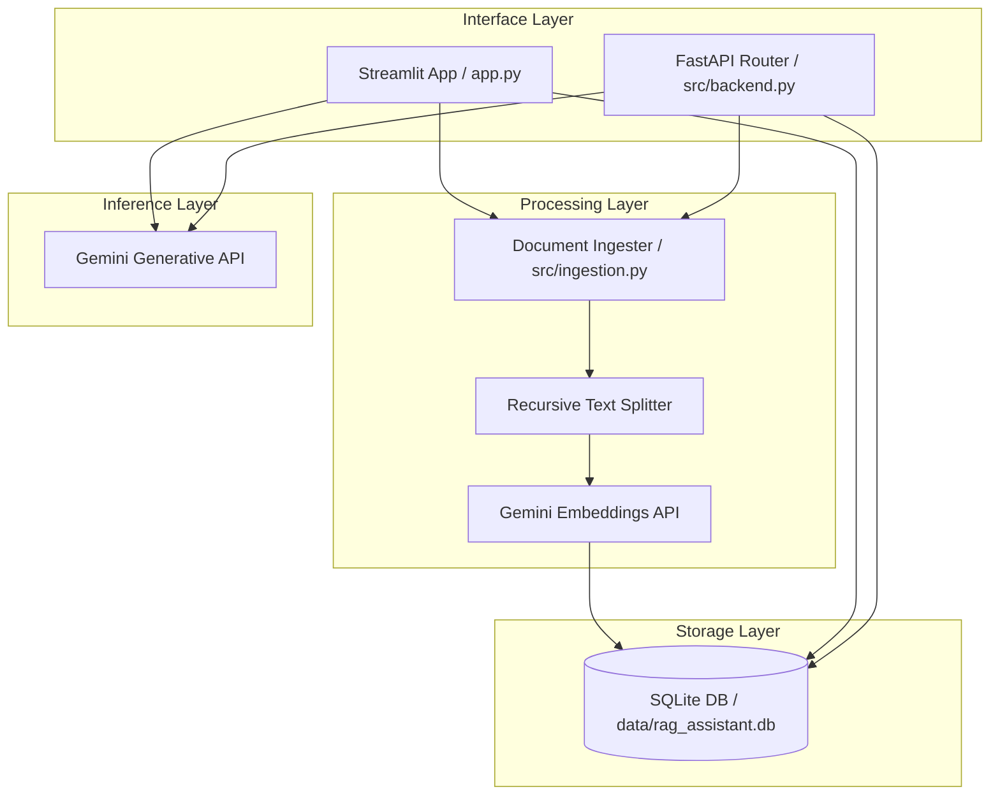

# Domain RAG Assistant

A lightweight, self-contained, and production-ready Retrieval-Augmented Generation (RAG) assistant. It features a local SQLite vector database with custom NumPy-based similarity searching and is powered by Google Gemini APIs for vector embedding generation (`text-embedding-004`) and context-aware text generation (`gemini-1.5-flash`).

## System Architecture



### Core Components
1. **Streamlit UI (`app.py`)**: A modern, interactive dark-mode workspace to upload documents (PDF, TXT, MD), manage existing knowledge objects, adjust top-k retrieval bounds, and chat with domain documents.
2. **FastAPI Backend (`src/backend.py`)**: REST endpoints that mirror all front-end functionalities. This allows programmatic document uploading, list-management, and query execution.
3. **Document Ingester (`src/ingestion.py`)**: Handles document reading, recursive chunk partitioning (supporting overlap settings), and batching embeddings calls to the Gemini API.
4. **Vector Database (`src/database.py`)**: A database built on top of SQLite to store documents, raw chunks, and meta-data. Vector search matching is performed locally using NumPy vector dot products and normalization for fast similarity checks.

---

## Directory Structure

```
domain-rag-assistant/
├── data/                  # SQLite database file and uploads cache
├── src/
│   ├── __init__.py        # Package initializer
│   ├── ingestion.py       # Extract text, chunk, and embed documents
│   ├── database.py        # SQLite vector storage and NumPy cosine search
│   └── backend.py         # FastAPI REST service
├── app.py                 # Streamlit Chat Dashboard
├── requirements.txt       # Python dependencies
└── README.md              # Documentation
```

---

## Installation & Setup

### 1. Clone & Navigate to Project Directory
Ensure you are in the workspace root:
```bash
cd domain-rag-assistant
```

### 2. Configure Environment Variables
Create a `.env` file in the root directory:
```env
GEMINI_API_KEY=your_gemini_api_key_here
```

### 3. Install Dependencies
It is recommended to use a virtual environment:
```bash
python -m venv venv
# On Windows
venv\Scripts\activate
# On macOS/Linux
source venv/bin/activate

pip install -r requirements.txt
```

---

## Running the Application

### Option A: Streamlit Dashboard UI (Recommended)
Launch the interactive web workspace:
```bash
streamlit run app.py
```
This will start the dashboard at `http://localhost:8501`.

### Option B: FastAPI Backend API Server
Start the REST API server:
```bash
uvicorn src.backend:app --reload --host 127.0.0.1 --port 8000
```
- Interactive API Documentation (Swagger UI): `http://127.0.0.1:8000/docs`
- Redoc API documentation: `http://127.0.0.1:8000/redoc`

---

## API Endpoints Reference

### 1. Ingest Document
* **Endpoint**: `POST /ingest`
* **Content-Type**: `multipart/form-data`
* **Body**: `file` (Upload file: `.pdf`, `.txt`, or `.md`)
* **Response**:
  ```json
  {
    "status": "success",
    "data": {
      "document_id": "uuid-string-value",
      "chunks_count": 12,
      "filename": "document.pdf"
    }
  }
  ```

### 2. List Ingested Documents
* **Endpoint**: `GET /documents`
* **Response**:
  ```json
  [
    {
      "id": "uuid-string-value",
      "filename": "document.pdf",
      "uploaded_at": "2026-07-01 10:00:00"
    }
  ]
  ```

### 3. Query (Ask Question)
* **Endpoint**: `POST /query`
* **Headers**: `Content-Type: application/json`
* **Body**:
  ```json
  {
    "prompt": "What are the core metrics for Phase 1?",
    "top_k": 4,
    "system_instruction": "Answer the question using the context provided."
  }
  ```
* **Response**:
  ```json
  {
    "answer": "Generated answer based on similarity matches...",
    "sources": [
      {
        "filename": "document.pdf",
        "score": 0.8921,
        "text": "Extracted text content from matching chunk..."
      }
    ]
  }
  ```

### 4. Delete Document
* **Endpoint**: `DELETE /documents/{doc_id}`
* **Response**:
  ```json
  {
    "status": "success",
    "message": "Document uuid-string-value successfully deleted."
  }
  ```
