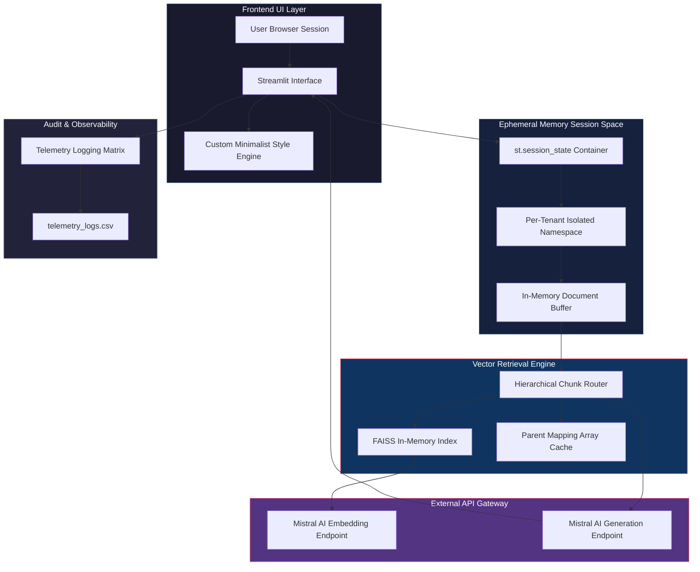

# Document Intelligence Engine(CONTEXTFLOW)

**A Zero-Persistence, Multi-Tenant RAG Platform for Enterprise Document Analytics**

Document Intelligence Engine is a Bring-Your-Own-Document (BYOD) Retrieval-Augmented Generation platform engineered for enterprise-grade privacy guarantees. Every uploaded PDF is processed entirely in-memory — with zero server-side disk writes — ensuring complete session isolation across concurrent tenants. Built on a hierarchical Parent-Child chunking architecture and a continuous text-stitching ingestion pipeline, the engine delivers sub-second, streaming, context-faithful answers over arbitrarily large and structurally complex documents.

---

## System Architecture

The platform is composed of four discrete layers: the presentation layer (Streamlit), the ephemeral session/memory layer, the vector retrieval engine (FAISS, in-memory), and the external inference gateway (Mistral AI). No layer persists tenant data beyond the lifetime of the active session.



**Key architectural guarantee:** Because `st.session_state` and the FAISS index both live exclusively in process memory and are scoped per session, no tenant's document fragments, embeddings, or query history are ever addressable by another concurrent user — and nothing survives a session teardown.

---

## Core Operational Workflow: Ingestion Pipeline

The ingestion pipeline transforms a raw uploaded file into a dual-resolution, query-ready vector space in six deterministic stages.


**Pipeline stage summary:**

| Stage | Transformation | Output Artifact |
|---|---|---|
| 1. File Stream Upload | PDF bytes read directly into an in-memory buffer; no `/tmp` or disk write occurs | Raw byte stream |
| 2. Continuous Text Stitching | Page boundaries are dissolved and text is concatenated into a single contiguous stream | Unified document text |
| 3. Sliding Window Parent Block Generation | Text is windowed into overlapping Parent blocks (1500 chars, 300-char overlap) | Parent block set |
| 4. Target Child Chunk Extraction | Each Parent block is further subdivided into dense Child chunks (300 chars, 50-char overlap) | Child chunk set with parent UUID tags |
| 5. Transformed Token Generation & Vector Seeding | Child chunks are embedded via `mistral-embed` and seeded into the FAISS index | Dense vector index |
| 6. Parent Mapping Array Cache | Child UUIDs are cross-referenced to their originating Parent block in a lookup cache | Parent Mapping Array |

---

## Under the Hood: How It Works

### Stateless Multi-Tenancy

The engine enforces tenant isolation without a database, without disk persistence, and without a session broker. Every user connecting to the Streamlit application is allocated a fresh, independent `st.session_state` dictionary by the Streamlit runtime itself. This container holds:

- The parsed document buffer
- The FAISS index instance for that session
- The Parent Mapping Array Cache
- Full chat and retrieval history

Because `st.session_state` is scoped strictly to the browser session's WebSocket connection, there is no code path by which Tenant A's `session_state` object can be referenced, iterated, or leaked into Tenant B's execution context. When a session ends — via tab closure, timeout, or explicit reset — the entire in-memory object graph is garbage collected. There is no cleanup job, no soft-delete flag, and no residual record on disk. This is a materially stronger privacy posture than architectures relying on database row-level security, since there is simply no persistent row to secure.

### The Page-Break Trap Resolution

Standard RAG ingestion pipelines typically extract text on a page-by-page basis and chunk each page independently. This approach introduces a well-documented failure mode — the **Page-Break Trap** — in which a sentence, table row, or logical clause that spans two physical PDF pages is split mid-thought. The resulting chunks are individually incoherent, and any embedding generated from a truncated fragment produces a semantically degraded vector that fails to retrieve correctly against a user's natural-language query.

The Document Intelligence Engine avoids this trap by performing **continuous text-stitching** prior to any chunking operation. All page-level text extractions are concatenated into a single, uninterrupted character stream before the sliding-window chunker ever executes. Page-break artifacts (form feeds, page-number headers/footers, and hard breaks) are normalized and discarded during stitching, so the chunking boundaries that follow are determined purely by content length and semantic overlap — never by the incidental pagination of the source PDF. The practical effect is that a paragraph beginning on page 4 and concluding on page 5 is treated by the chunker as what it actually is: one uninterrupted paragraph.

### Hierarchical Chunk Routing

The engine implements a two-tier **Parent-Child chunking** strategy to resolve a fundamental tension in RAG system design: small chunks retrieve with high precision, but large chunks generate with high fidelity.

- **Child chunks** (300 characters, 50-character overlap) are deliberately small and semantically tight. These are the units embedded via `mistral-embed` and indexed in FAISS. Their small size maximizes cosine-similarity precision — a dense, narrowly-scoped vector matches a user's query with far less semantic dilution than a vector generated from a long, topically diverse passage.
- **Parent chunks** (1500 characters, 300-character overlap) are never embedded or searched directly. Instead, each Child chunk carries a tracking UUID that maps back to its originating Parent block via the Parent Mapping Array Cache.

At query time, the retrieval flow is:

1. The user's query is embedded and matched against the **Child vector space** in FAISS, returning the top-k most semantically precise chunk IDs.
2. Each returned Child UUID is resolved through the Parent Mapping Array Cache to its full **Parent block**.
3. The **Parent blocks** — not the narrow Child chunks — are assembled into the context window passed to `mistral-small-latest`.

This decoupling means the system searches with precision and answers with context. A narrow Child match guarantees relevance, while the wider Parent payload ensures the LLM receives enough surrounding text to generate a complete, non-fragmented, contextually grounded response — directly eliminating the "correct chunk, incomplete answer" failure mode common in flat single-tier RAG architectures.

---

## The Enterprise Technical Stack

| Component Layer | Technology Selection | Specific Model / Version | Production Rationale |
|---|---|---|---|
| Runtime Environment | Python | 3.10 | Balances mature async/typing support with broad library compatibility across the LangChain and FAISS ecosystems |
| Application Frontend | Streamlit | Custom minimalist theme override | Enables rapid, session-native UI delivery with first-class `st.session_state` support for tenant isolation |
| Orchestration Framework | LangChain | Latest stable | Provides composable document loaders, text splitters, and retrieval chain abstractions |
| Vector Store | FAISS (in-memory) | `IndexFlatL2` / equivalent | Sub-millisecond similarity search with zero external infrastructure dependency; index is disposable per session |
| Embedding Model | Mistral AI | `mistral-embed` | High-dimensional dense embeddings optimized for semantic retrieval accuracy on short Child chunks |
| Generation Model | Mistral AI | `mistral-small-latest` | Optimized for low-latency, sub-second token streaming suited to interactive chat UX |
| Document Parsing | PyPDF / equivalent in-memory extractor | Streamed byte-buffer parsing | Extracts text directly from upload buffer with no intermediate disk write |
| Telemetry Layer | Pandas-backed CSV logger | `telemetry_logs.csv` | Lightweight, dependency-free structured logging compatible with downstream BI ingestion |
| Session Management | Streamlit native | `st.session_state` | Zero-infrastructure, per-connection isolation without a database or session broker |

---

## Automated Audit Telemetry Matrix

Every query-response cycle is logged to a structured, append-only ledger (`telemetry_logs.csv`) for observability, quality auditing, and downstream analytics. The schema is intentionally flat and typed for direct ingestion by BI tools such as Power BI without an intermediate ETL transformation layer.

| Column | Metric Type | Description | Downstream Rationale |
|---|---|---|---|
| `timestamp` | Datetime (ISO 8601) | UTC timestamp of the query event | Native datetime typing enables direct time-series aggregation and trend visualization in Power BI without string parsing |
| `message_id` | String (UUID) | Unique identifier for the query-response pair | Provides a stable primary key for joining telemetry against session-level or feedback-level tables |
| `query` | String (Text) | The raw natural-language user query | Enables downstream NLP analysis — topic clustering, query-intent classification, and failure-mode auditing |
| `latency_sec` | Float (Continuous) | End-to-end wall-clock time from query submission to final streamed token | Core performance KPI; supports P50/P95/P99 latency dashboards and SLA monitoring |
| `retrieved_chunks` | Integer (Discrete) | Count of Child chunks retrieved from FAISS for the query | Diagnostic signal for retrieval-quality tuning and top-k configuration audits |
| `response_length` | Integer (Discrete) | Character count of the generated response | Correlates with generation cost and can flag anomalously short or truncated responses |
| `feedback` | Categorical (Nullable) | User-submitted rating (e.g., positive/negative/none) | Enables supervised quality-monitoring dashboards and regression detection across model or prompt versions |

Because every column is strictly typed and free of nested or delimited sub-fields, the CSV loads cleanly into Power BI's native data model, requiring no custom Power Query transformation step — a deliberate design choice to keep the observability layer maintenance-free.

---

## Installation & Local Deployment

### 1. Establish the Python 3.10 Sandbox

```bash
python3.10 -m venv venv
source venv/bin/activate      # On Windows: venv\Scripts\activate
python --version               # Verify: Python 3.10.x
```

### 2. Configure Environment Variables

Create a `.env` file at the project root:

```bash
touch .env
```

Populate `.env` with the required credentials:

```env
MISTRAL_API_KEY=your_mistral_api_key_here
MISTRAL_EMBED_MODEL=mistral-embed
MISTRAL_GENERATION_MODEL=mistral-small-latest
```

### 3. Install Dependencies

```bash
pip install --upgrade pip
pip install -r requirements.txt
```

### 4. Launch the Deployment Engine

```bash
streamlit run app.py
```

The application will be served locally at `http://localhost:8501`. Each browser tab that connects will be allocated its own isolated `st.session_state` — verifying multi-tenant separation is as simple as opening the application in two separate browser sessions and confirming that uploaded documents do not cross-contaminate.

---

**Document Intelligence Engine** — precision retrieval, faithful generation, zero footprint.
